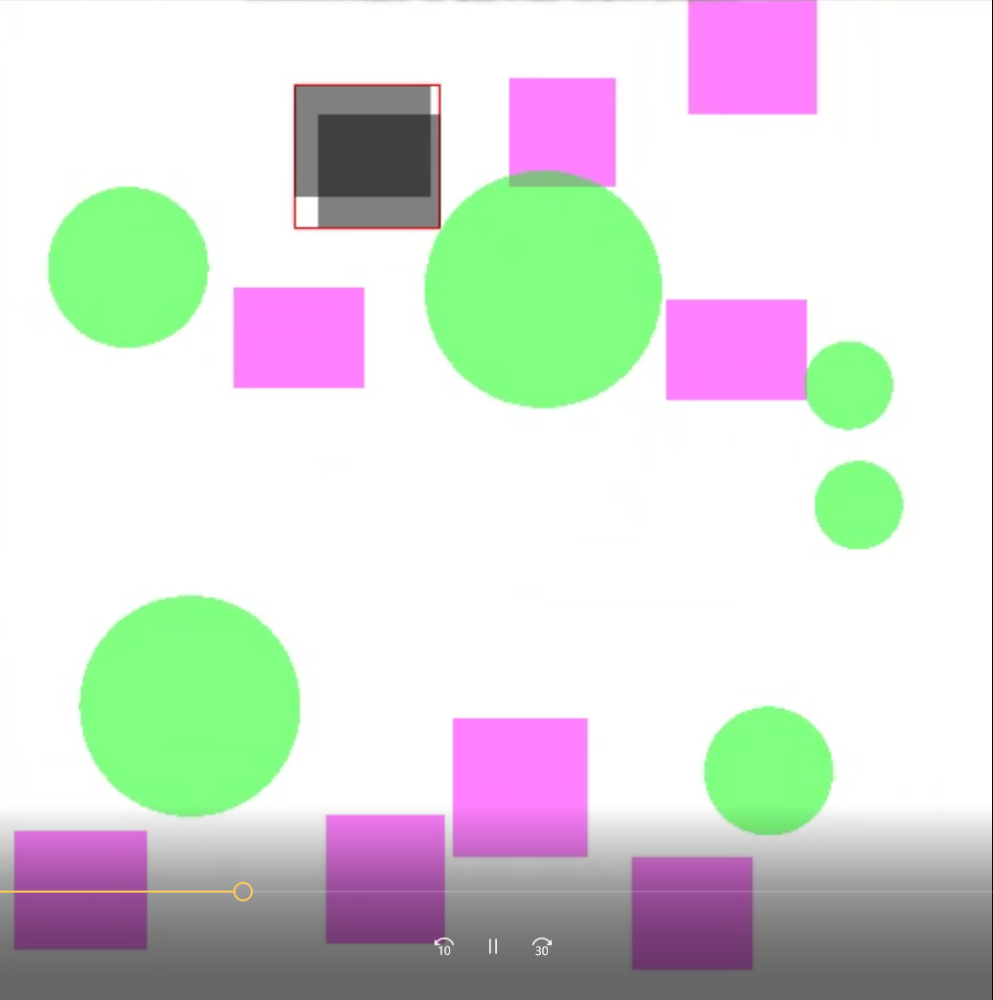

# The-Intersection-of-Shapes
Determining the intersection of different shape objects using OOP logic. The main goal is, there are circles and rectangles floating in a window ,if same type of objects such as circle-circle or rectangle-rectangle intersect, the intersected objects will turn into gray and there will be a rectangle created to surround both intersected objects.

Necessary Installations:
The preparation of your environment for running graphics functions requires;
    Please follow the instructions below if you did not prepare your environment

1- Install glut packages to your linux environment. You can do this using the following command from
a terminal (console)
sudo apt-get install freeglut3 freeglut3-dev

2- Then, update your packages using:
sudo apt-get update

if your Ubuntu version is higher than 11.10, this update will install the true versions of the glut
library.

3- Test your installations by writing this simple code in a test.cpp file:
#include <GL/glut.h>
//Drawing funciton
voiddraw(void)
{//Background color
glClearColor(0,1,0,1);
glClear(GL_COLOR_BUFFER_BIT);
//Draw order
glFlush();
}
//Main program
intmain(intargc,char**argv)
{
glutInit(&argc,argv);
//Simple buffer
glutInitDisplayMode(GLUT_SINGLE|GLUT_RGB);
glutInitWindowPosition(50,25);
glutInitWindowSize(500,250);
glutCreateWindow("Green window");
//Call to the drawing function
glutDisplayFunc(draw);
glutMainLoop();
return0;
}

4- Compile test.cpp file, linking the OpenGL/Glut libraries (be careful to write the g++ command with
the same order as shown below):
>g++ -o test test.cpp -lGL -lglut

5-Run your test application:
>./test

6- See a green window.
Now your working environment is ready to begin.

Compilation Command for the Intersecting of the Shapes:
>g++ ShapesMain.cpp Rectangle.cpp Circle.cpp -lGL -lglut -o IntersectingShapes
Run your game using:
>./IntersectingShapes

Sample 1

Sample 2

Sample 3

Sample 4

